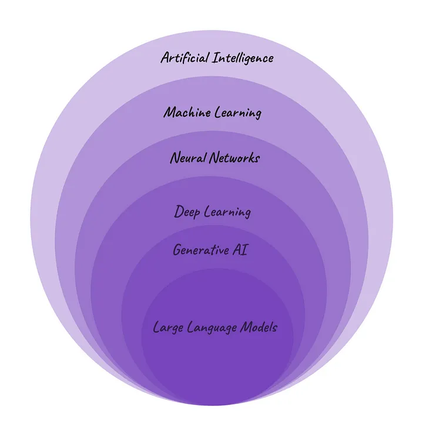

# Generative AI <!-- omit in toc -->

## Contents <!-- omit in toc -->

- [1. Introduction](#1-introduction)
  - [1.1. Details](#11-details)
  - [1.2. Characteristics](#12-characteristics)
    - [1.2.1. Self Supervised Learning + Reinforcement learning from human feedback (RLHF)](#121-self-supervised-learning--reinforcement-learning-from-human-feedback-rlhf)
    - [1.2.2. Transformer Model Structure – Self Attention, Positional Encoding and Beam Search](#122-transformer-model-structure--self-attention-positional-encoding-and-beam-search)

# 1. Introduction

- What is Generative AI?
- Foundation Models, LLMs, Chat GPT etc.
- And how is it different from the AI we have talked about before?
  - Generative AI refers to AI models or algorithms that create output, such as text, photos, videos, code, data, or 3D renderings, from the vast amounts of data they are trained on.
  - Models 'generate' new content by referring back to the data they have been trained on, making new predictions.

## 1.1. Details

- Generative AI (GenAI) is subset of Deep Learning, that can generate different types of content based on what has learnt from existing content.
  - The underlying model that enables Generative AI to work is called a Foundation model Large Language Model (LLM) is a form of generative AI, which focuses on generating human-like text based on the patterns learned from vast amounts of textual data during the training process.
- So, LLM is a specific type of Foundation model specialized in natural language processing

[Font](https://medium.com/womenintechnology/ai-c3412c5aa0ac)

## 1.2. Characteristics

- 3 characteristics which makes Large Language Models so powerful:
  - A> LLMs can self - learn from vast amount of data and then they also learn from human feedback.
    - **Self Supervised Learning + Reinforcement learning from human feedback (RLHF).**
  - B> LLMs can process all text inputs in parallel and can remember the whole text while generating prediction.
  - C> LLMs are better equipped to understand context of the word (and group of words) in relation to overall text.
    - **B> and C> Transformer Model Structure – Self Attention, Positional Encoding and Beam Search.**

### 1.2.1. Self Supervised Learning + Reinforcement learning from human feedback (RLHF)

- **Earlier models** were trained with **manually-labeled data** written by humans.
  - This was incredibly expensive to produce.
- LLMs are trained by **Self Supervised Learning**, where the model is trained on raw, unlabeled data and it generates labels for the data by itself.
- Result of the training process is a **neural network with hundreds of billions of connections** between the millions of neurons, each defined by the model itself.
- Estimates indicate that **GPT-3 was trained on around 45 terabytes of text** data-that's about one million feet of bookshelf space.
- Post initial training, **supervisors and end users also help to train LLMs**.
  - This **human reinforcement learning** helps point out mistakes, rank answers based on how good they are, and gives the AI high-quality results to aim for.
- LLMs then **refine their internal neural networks** further to get better results next time.

### 1.2.2. Transformer Model Structure – Self Attention, Positional Encoding and Beam Search

- Earlier neural network models like Recurrent Neural Networks (RNNs) can process incoming data one at a time while retaining a state that summarizes the history of previous inputs.
  - Long Short-Term Memory (LSTM) Networks and GRUs are other models with improved ability to selectively retain or forget information over time.
- LLMs use a particular neural network architecture called a **transformer**, which process an **entire sequence at once** - be that a sentence, paragraph or an entire article - analyzing all its parts and not just individual words.
- Transformers are based on the idea of "attention".
  - **Self-attention** looks at each word in a body of text and decides **which others are most important** to understanding its meaning.
  - Distance between words in the input sequence does not matter
- This allows the software to capture context and patterns better, and understand the **meanings,positions and relationships** between words – to generate more accurately.
- Earlier models were based on **greedy search** which predicted one word at a time.
  - Transformers use **beam search** to enhance the quality of their output.
  - Rather than focusing only on the next word in a sequence, it looks at the probability of a larger set of words as a whole and then predicts.
